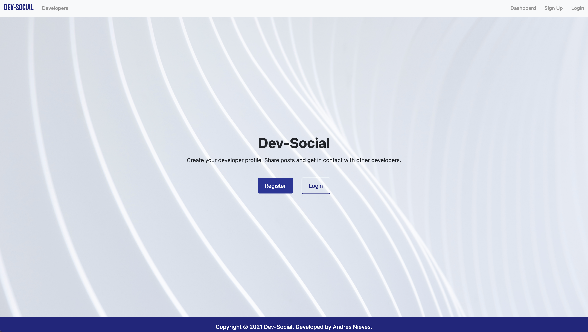
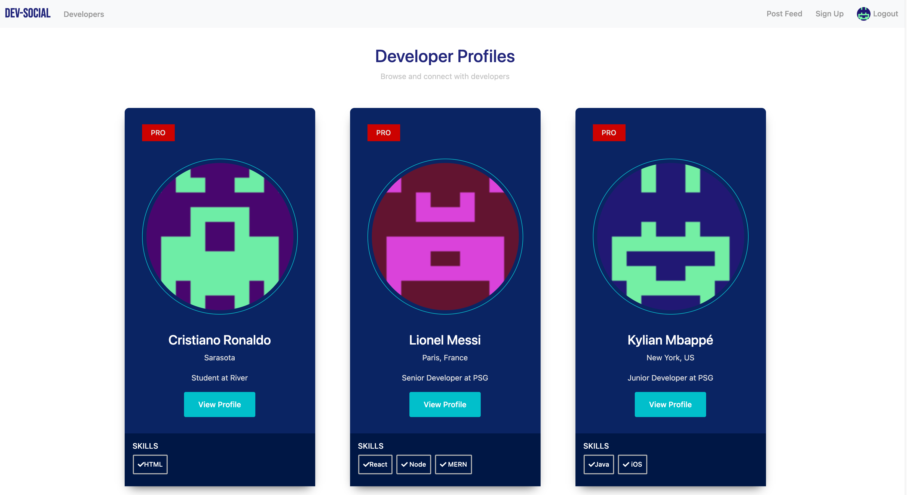
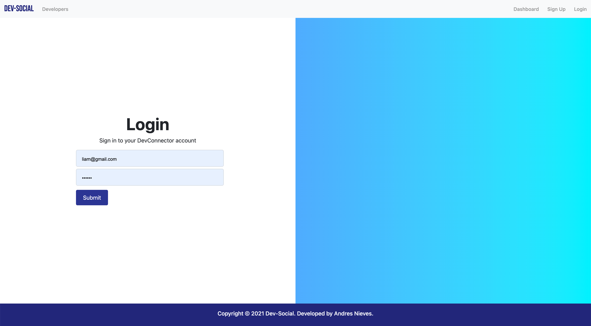

<!-- PROJECT LOGO -->
<br />
<p align="center">
  <a>
    
  </a>

  <h3 align="center">Dev-Social</h3>

  <p align="center">
    Social Media Platform build with MERN Stack
    <br />
</p>

  <p align="center">
    Developed by Andres Nieves © 2021
    <br />
</p>

<!-- TABLE OF CONTENTS -->
<details open="open">
  <summary>Table of Contents</summary>
  <ol>
    <li>
      <a href="#about-the-project">About The Project</a>
      <ul>
        <li><a href="#built-with">Built With</a></li>
      </ul>
    </li>
    <li>
      <a href="#getting-started">Getting Started</a>
      <ul>
        <li><a href="#prerequisites">Prerequisites</a></li>
        <li><a href="#installation">Installation</a></li>
      </ul>
    </li>
    <li><a href="#usage">Usage</a></li>
    <li><a href="#roadmap">Roadmap</a></li>
    <li><a href="#contributing">Contributing</a></li>
    <li><a href="#license">License</a></li>
    <li><a href="#contact">Contact</a></li>
    <li><a href="#acknowledgements">Acknowledgements</a></li>
  </ol>
</details>

<!-- ABOUT THE PROJECT -->

## About The Project





Social media platform built using MERN Stack. Features:

- Register & Login page.
- Profile page.
- Profile info (experience, education, etc).
- Profile display page.
- List of friends.
- Posting comments.
- Like, dislike buttons, commeting posts.
- User logout.

### Built With

The webapp was built using the following technologies:

- [MERN STACK](https://jquery.com)
- [React](https://reactjs.org/)
- [Node](https://nodejs.org/)
- [Express js](https://expressjs.com/)
- [MongoDB](https://mongodb.com/)
- [Redux](https://redux.js.org/)
- [Redux Toolkit](https://redux-toolkit.js.org/)
- [React-router](https://reactrouter.com/)
- [Axios](https://www.axios-http.com)
- [Moment.js](https://momentjs.com/)
- [SASS](https://sass-lang.com/)
- [Classnames.js](https://www.npmjs.com/package/classnames)
- [Nodemon](https://www.npmjs.com/package/nodemon)
- [Mongoose](https://mongoosejs.com/)
- [Bcrypt](https://www.npmjs.com/package/bcrypt)
- [DotEnv](https://www.npmjs.com/package/dotenv)
- [JsonWebtoken](https://www.npmjs.com/package/jsonwebtoken)
- [Passport.js](http://www.passportjs.org/)
- [Passport-jwt](http://www.passportjs.org/packages/passport-jwt/)
- [Jwt-decode](https://www.npmjs.com/package/jwt-decode)
- [Body-parser](https://www.npmjs.com/package/body-parser)
- [Concurrently.js](https://www.npmjs.com/package/concurrently)
- [Validator.js](https://www.npmjs.com/package/validatorjs)
- [Gravatar](https://www.gravatar.com)
- [Bootstrap](https://getbootstrap.com)

## Installation

1. Clone the repo
   ```sh
   git clone https://github.com/myvisualdna/devconnect.git
   ```
2. Open a terminal on devconnect folder and install NPM packages

   ```sh
   npm install
   ```

3. Open a terminal on devconnect/client folder and install NPM packages
   ```sh
   npm install
   ```
4. Open a terminal on devconnect folder to run the app
   ```sh
   npm run dev
   ```

<!-- LICENSE -->

## License

Distributed under the MIT License. See `LICENSE` for more information.

<!-- CONTACT -->

## Contact

Andres Nieves - myvisualdna@gmail.com

Project Link: [https://github.com/myvisualdna/devconnect](https://github.com/myvisualdna/devconnect)

<!-- ACKNOWLEDGEMENTS -->

## Acknowledgements

Developed by Andres Nieves © 2021
